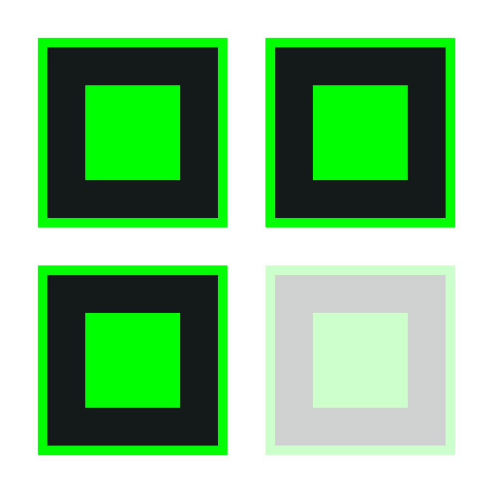

# Tetris

  

A Tetris clone web and desktop app.

## Web

[Click here](https://dk-tetris.netlify.app/).

## Mobile

[Follow the instructions here](https://www.installpwa.com/from/dk-tetris.netlify.app).

## Desktop

Go to the [releases page](https://github.com/Daniel-Knights/tetris/releases), download and run the appropriate installer:

- MacOS: `.dmg`, `.app`
- Windows: `.msi`, `-setup.exe`
- Linux: `.deb`, `.AppImage`

## Controls

<kbd>◀</kbd> - Move left  
<kbd>▶</kbd> - Move right  
<kbd>▲</kbd> - Rotate  
<kbd>▼</kbd> - Soft drop  
<kbd>space</kbd> - Hard drop  
<kbd>esc</kbd> - Pause/Resume
